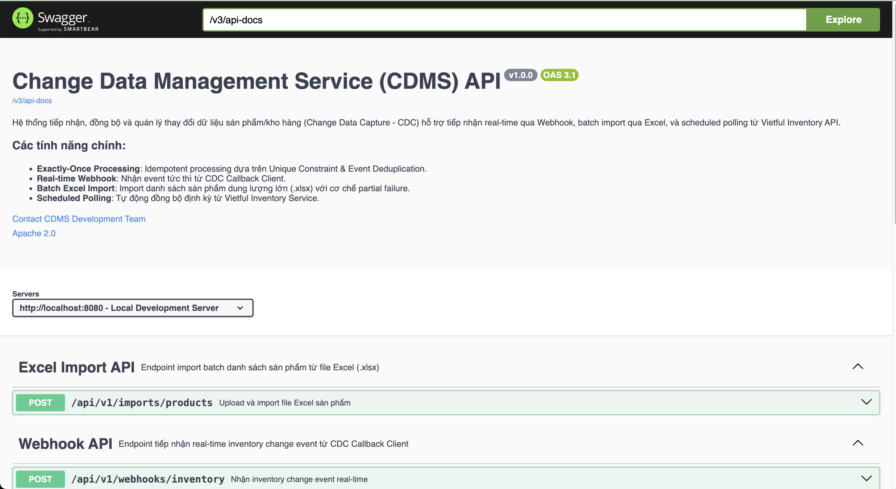
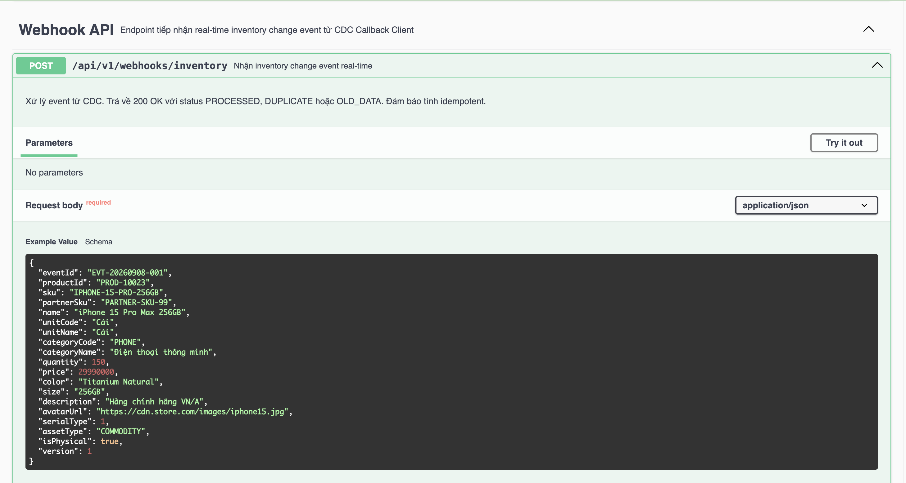
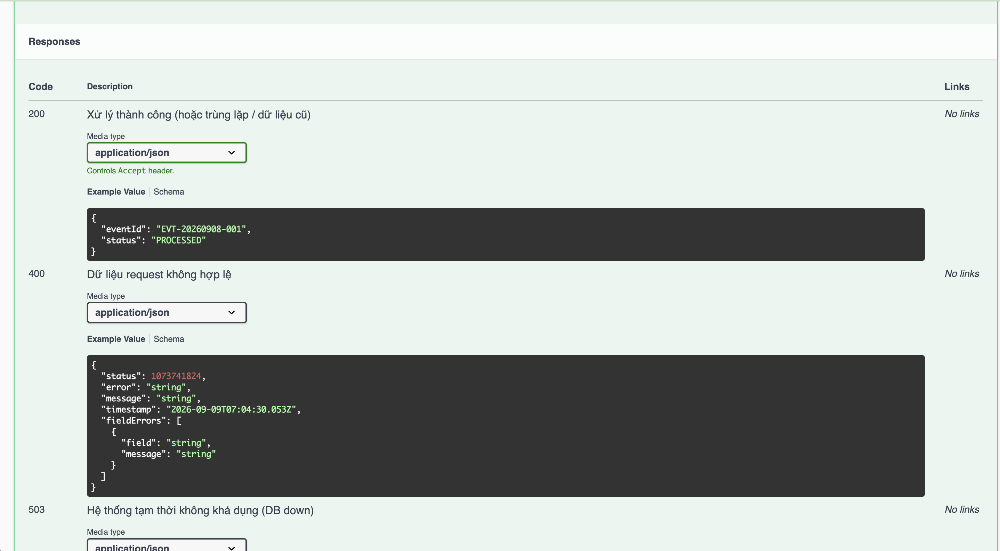
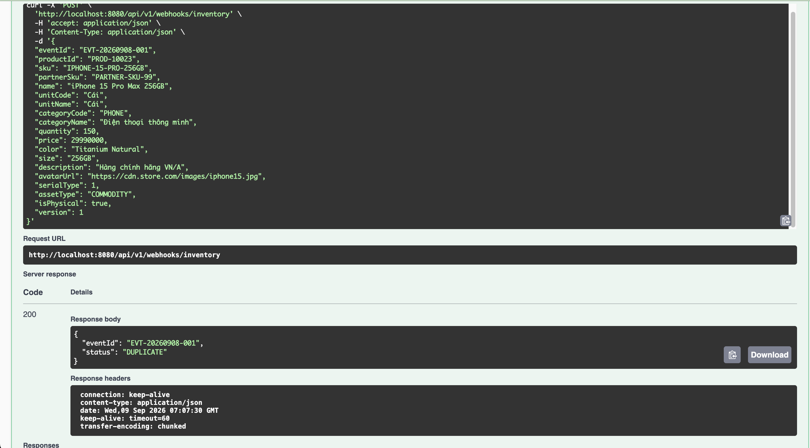
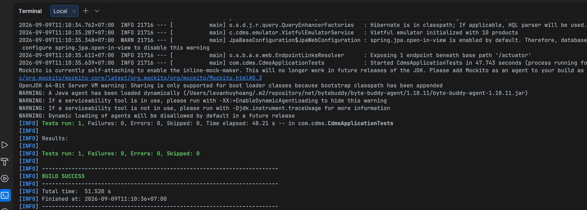
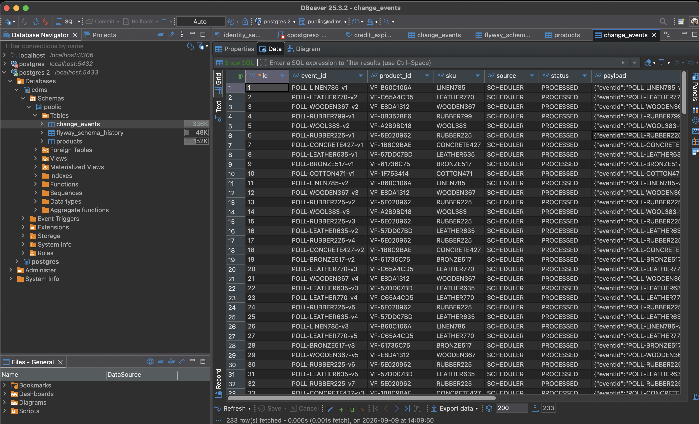
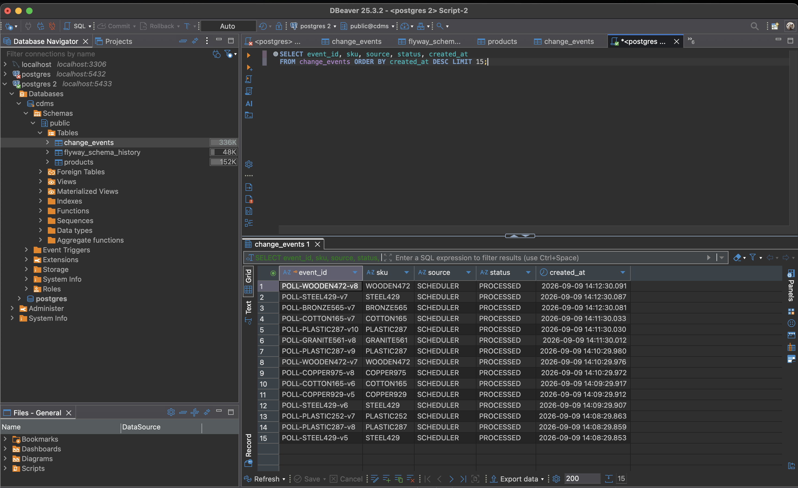
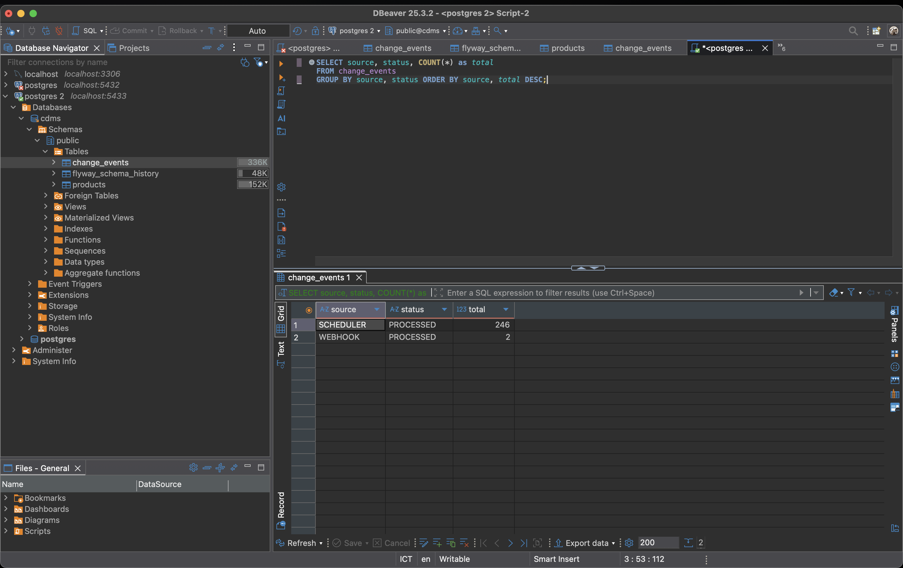
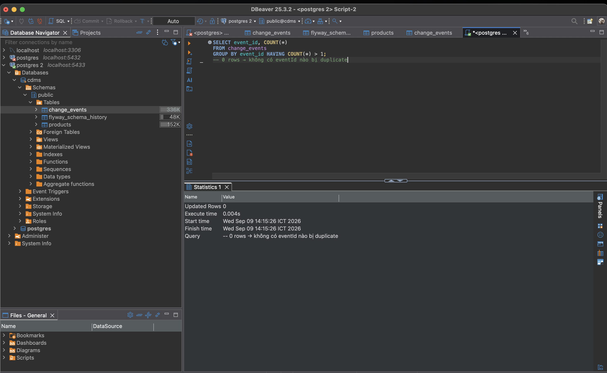

# 🚀 CDMS — Change Data Management Service

> **Change Data Management Service (CDMS)** là hệ thống backend chuyên biệt tiếp nhận, xác thực và đồng bộ dữ liệu biến động kho hàng (**Change Data Capture - CDC**) từ hệ thống đối tác **Vietful Inventory System** vào cơ sở dữ liệu nội bộ — với cam kết **Exactly-Once Processing** tuyệt đối dưới mọi tình huống.

---

## 💡 Tính Năng Nổi Bật

| # | Tính năng | Mô tả |
|---|---|---|
| 🛡️ | **Exactly-Once Processing** | Mỗi event chỉ được xử lý đúng 1 lần, kể cả khi retry hay race condition 100 threads |
| ⚡ | **Real-time Webhook** | Tiếp nhận event tức thì từ CDC Callback Client qua REST |
| ⏱️ | **Scheduled Polling** | Tự động quét Vietful API định kỳ (mặc định 60s), tự phục hồi khi Vietful down |
| 📊 | **Batch Excel Import** | Import `.xlsx` quy mô lớn — dòng lỗi không dừng cả batch (Partial Failure) |
| 🧪 | **Emulated Vietful Service** | Vietful giả lập tích hợp sẵn (DataFaker), test độc lập không cần staging |
| 📖 | **Swagger UI / OpenAPI 3.0** | Tài liệu API tương tác, test trực tiếp trên trình duyệt |
| 🐳 | **Docker & Docker Compose** | Multi-stage build, chạy toàn bộ bằng một lệnh duy nhất |

---

## 🛠️ Công Nghệ Sử Dụng

| Tầng | Công nghệ |
|------|-----------|
| **Core Framework** | Java 21, Spring Boot 4.1.1 (WebMVC, Data JPA, Validation, Actuator) |
| **Database** | PostgreSQL 16, Flyway Migration, HikariCP |
| **Excel Parser** | Apache POI `poi-ooxml` 5.4.1 |
| **Fake Data** | DataFaker 2.4.3 (Vietful Emulator) |
| **API Docs** | SpringDoc OpenAPI `springdoc-openapi-starter-webmvc-ui` 2.8.5 |
| **Testing** | JUnit 5, Testcontainers (PostgreSQL 16)|
| **Infrastructure** | Docker, Multi-stage Dockerfile, Docker Compose |

---

## ⚡ Quickstart

### Yêu cầu: Docker & Docker Compose đang chạy

```bash
# Khởi chạy toàn bộ hệ thống (PostgreSQL 16 + CDMS)
docker compose up --build -d

# Kiểm tra sức khỏe (~15s sau)
curl http://localhost:8080/actuator/health
# → {"status":"UP"}
```

| URL | Mô tả |
|-----|-------|
| `http://localhost:8080/swagger-ui.html` | Swagger UI — test API trực tiếp |
| `http://localhost:8080/v3/api-docs` | OpenAPI 3.0 JSON |
| `http://localhost:8080/actuator/health` | Health check |
| `http://localhost:8080/vietful/products` | Vietful Emulator |

```bash
# Xem log real-time
docker compose logs -f cdms

# Dừng hệ thống
docker compose down
```

### Chạy Local (không Docker)

```bash
# B1: Khởi chạy PostgreSQL
docker compose up -d postgres

# B2: Chạy Spring Boot
./mvnw spring-boot:run
```

---

## 🏛️ Kiến Trúc Hệ Thống

### Nguyên tắc cốt lõi

> **Ba nguồn ingestion — Một service xử lý duy nhất**

```
Webhook Request  (POST /api/v1/webhooks/inventory)  ─┐
Polling Scheduler (GET /vietful/products, 60s)       ─┼──→ ChangeData ──→ ChangeProcessingService ──→ PostgreSQL
Excel Import     (POST /api/v1/imports/products)     ─┘
```

Mọi nguồn dữ liệu đều được chuẩn hóa thành `ChangeData` (internal model) trước khi đi qua `ChangeProcessingService`. Điều này áp dụng **DRY** và **Single Responsibility**: logic dedup, version check, upsert chỉ viết **một lần duy nhất**.

### Luồng xử lý chi tiết

```
Incoming Event
      │
      ▼
┌─────────────────────────────────────────────────────┐
│  Step 1: Layer 1 Dedup                               │
│  changeEventRepository.existsByEventId(eventId)?    │
│  YES → return DUPLICATE (fast path, no transaction) │
└──────────────────────────┬──────────────────────────┘
                           │ NO
                           ▼
┌─────────────────────────────────────────────────────┐
│  Step 2: Version Check                               │
│  incoming.version <= product.version?               │
│  YES → return OLD_DATA                              │
└──────────────────────────┬──────────────────────────┘
                           │ NO
                           ▼
┌─────────────────────────────────────────────────────┐
│  Step 3: Content Hash Check                          │
│  SHA-256(incoming) == product.content_hash?         │
│  YES → return OLD_DATA (same content, skip)         │
└──────────────────────────┬──────────────────────────┘
                           │ NO (data actually changed)
                           ▼
┌─────────────────────────────────────────────────────┐
│  Step 4: @Transactional                              │
│    1. Upsert product (INSERT or UPDATE)              │
│    2. INSERT change_event ← UNIQUE(event_id) kích   │
│       hoạt tại đây — Layer 2 DB Safety Net          │
└──────────────────────────┬──────────────────────────┘
                           │
              ┌────────────┴────────────┐
         COMMIT OK               DataIntegrityViolation
              │                         │
         PROCESSED               DUPLICATE (race condition)
```

### Cấu trúc dự án

```
src/main/java/com/cdms/
├── controller/
│   ├── WebhookController.java        POST /api/v1/webhooks/inventory
│   └── ExcelImportController.java    POST /api/v1/imports/products
├── service/
│   ├── ChangeProcessingService.java  ← CORE: exactly-once logic
│   ├── ExcelParserService.java       Apache POI parser
│   └── model/ChangeData.java         Internal unified model
├── domain/
│   ├── entity/Product.java
│   ├── entity/ChangeEvent.java
│   └── repository/...
├── scheduler/
│   └── InventoryPollingScheduler.java   @Scheduled polling
├── client/
│   └── VietfulInventoryClient.java      RestClient + retry
├── emulator/
│   ├── VietfulEmulatorController.java   GET/POST/PUT /vietful/products
│   ├── VietfulEmulatorService.java      In-memory store + random updates
│   └── FakerProductFactory.java         DataFaker data generation
├── config/
│   ├── RestClientConfig.java            RestClient + ObjectMapper beans
│   └── OpenApiConfig.java
└── exception/
    └── GlobalExceptionHandler.java      Centralized error handling
```

---

## 🛡️ Exactly-Once Processing — 2 Lớp Bảo Vệ

### Vấn đề cần giải quyết

Trong hệ thống CDC thực tế:
- CDC client **retry** khi không nhận được HTTP 200 → cùng event gửi nhiều lần
- Nhiều instance CDMS chạy song song → **race condition**: 2 thread cùng INSERT cùng `event_id`

### Giải pháp: 2 lớp bảo vệ xếp chồng

```
Layer 1 (Application): existsByEventId()
  → Tốc độ cao, tránh overhead transaction cho 99% duplicate đã biết
  → KHÔNG đủ với race condition

Layer 2 (Database): UNIQUE CONSTRAINT (event_id) trên bảng change_events
  → Atomic, thread-safe, ACID guarantee
  → Khi 2 thread cùng vượt qua Layer 1 → DB chỉ cho 1 INSERT thành công
  → Thread còn lại nhận DataIntegrityViolationException → DUPLICATE
```


---

## 📊 Database Schema

### Bảng `products`

```sql
CREATE TABLE products (
    id           BIGSERIAL PRIMARY KEY,
    external_id  VARCHAR(100) NOT NULL,  -- Vietful product ID
    sku          VARCHAR(100) NOT NULL,  -- Product SKU
    name         VARCHAR(500),
    unit_code    VARCHAR(50),            -- CAI | HOP | KG | GOI | CHIEC
    category_code VARCHAR(100),
    quantity     INTEGER DEFAULT 0,
    price        NUMERIC(18, 2),
    color        VARCHAR(100),           -- Red | Blue | Black | White | ...
    size         VARCHAR(50),            -- XS | S | M | L | XL | XXL
    serial_type  SMALLINT,              -- 0: không serial, 1: có serial
    asset_type   VARCHAR(50),           -- Single | Bundle
    is_physical  BOOLEAN DEFAULT false,
    version      BIGINT DEFAULT 0,      -- Monotonically increasing, detect old data
    content_hash VARCHAR(64),           -- SHA-256: skip nếu data không đổi
    source       VARCHAR(50),           -- WEBHOOK | SCHEDULER | EXCEL
    created_at   TIMESTAMP NOT NULL DEFAULT NOW(),
    updated_at   TIMESTAMP NOT NULL DEFAULT NOW(),
    CONSTRAINT uq_products_external_id_sku UNIQUE (external_id, sku)
);
```

### Bảng `change_events` — Audit Log & Deduplication Key

```sql
CREATE TABLE change_events (
    id           BIGSERIAL PRIMARY KEY,
    event_id     VARCHAR(200) NOT NULL,  -- Dedup key
    product_id   VARCHAR(100),
    sku          VARCHAR(100),
    source       VARCHAR(50),            -- WEBHOOK | SCHEDULER | EXCEL
    status       VARCHAR(20),            -- PROCESSED | DUPLICATE | OLD_DATA | FAILED
    payload      TEXT,                   -- Raw JSON payload (audit/replay)
    payload_hash VARCHAR(64),
    created_at   TIMESTAMP NOT NULL DEFAULT NOW(),
    CONSTRAINT uq_change_events_event_id UNIQUE (event_id)  -- ← SAFETY NET
);
```

---

## 🌐 API Reference

### 1. Webhook — POST `/api/v1/webhooks/inventory`

```json
// Request
{
  "eventId":      "EVT-20260909-001",   // Required
  "productId":    "PROD-10023",          // Required
  "sku":          "IPHONE15PRO256",      // Required
  "partnerSku":   "INTERNAL-IPHONE15PRO256",
  "name":         "iPhone 15 Pro 256GB",
  "unitCode":     "CAI",                // CAI | HOP | KG | GOI | CHIEC
  "unitName":     "Cái",
  "categoryCode": "ELECTRONICS001",
  "categoryName": "Category ELECTRONICS",
  "quantity":     150,                   // >= 0
  "price":        29990000.00,
  "color":        "Black",              // Red | Blue | Black | White | Green | Yellow
  "size":         "L",                  // XS | S | M | L | XL | XXL
  "serialType":   1,                    // 0 hoặc 1
  "assetType":    "Single",            // Single | Bundle
  "isPhysical":   true,
  "version":      1                     // Long, monotonically increasing
}

// Response (HTTP 200 cho tất cả trường hợp hợp lệ)
{ "eventId": "EVT-20260909-001", "status": "PROCESSED" }  // Lần đầu
{ "eventId": "EVT-20260909-001", "status": "DUPLICATE" }  // Gửi lại
{ "eventId": "EVT-20260909-002", "status": "OLD_DATA"  }  // Version cũ
```

> **Tại sao DUPLICATE vẫn trả HTTP 200?**
> CDC client retry khi nhận 4xx/5xx — trả 200 + status=DUPLICATE là chuẩn Idempotent Webhook API,
> báo cho client "tôi đã biết event này, không cần retry nữa".

### 2. Excel Import — POST `/api/v1/imports/products`

```
Content-Type: multipart/form-data
Field: file (*.xlsx)
```

```json
// Response
{
  "total":     100,
  "processed": 97,
  "duplicate": 2,
  "old":       0,
  "failed":    1,
  "errors": ["Row 15: sku is required"]
}
```

### 3. Vietful Emulator

| Method | URL | Mô tả |
|--------|-----|-------|
| `GET` | `/vietful/products` | Danh sách sản phẩm (kèm random update) |
| `GET` | `/vietful/products/{id}` | Chi tiết sản phẩm |
| `POST` | `/vietful/products` | Tạo sản phẩm mới |
| `PUT` | `/vietful/products/{id}` | Cập nhật (tự tăng version) |

---

## 🛡️ Xử Lý Lỗi & Resilience

| Kịch bản | Hành vi hệ thống |
|----------|-----------------|
| **Vietful API timeout** | Retry tối đa 2 lần → bỏ qua lượt poll, **không crash** |
| **PostgreSQL down** | HTTP 503, KHÔNG trả 200 giả |
| **CDMS restart** | CDC gửi lại → DB lookup → DUPLICATE (idempotency từ constraint) |
| **Duplicate event** | HTTP 200 + `DUPLICATE` — không ghi thêm vào DB |
| **Old version event** | HTTP 200 + `OLD_DATA` — không ghi đè |
| **Excel row lỗi** | Ghi `failed++`, tiếp tục các row khác |
| **Race condition 100 threads** | DB UNIQUE constraint chỉ cho 1 INSERT → 99 nhận DUPLICATE |

---

## 🧪 Chiến Lược Testing


### Tầng 1 — Context Load Test

Verify Spring context khởi động thành công với Testcontainers PostgreSQL:

```bash
./mvnw test -Dtest=CdmsApplicationTests
```

### Tầng 2 — Concurrency Test (⭐ Quan trọng nhất)

**Mục tiêu:** Chứng minh exactly-once guarantee với PostgreSQL thật, không phải H2.


**Kịch bản A — Same Event:**
```
100 threads ──┐                    ┌── Thread 1: PROCESSED (INSERT thành công)
              ├── cùng EVT-001 ──→ ┤
              │   CountDownLatch   └── Thread 2..100: DUPLICATE (DataIntegrityViolation)
              └── (bắt đầu đồng thời)

DB: COUNT(change_events WHERE event_id='EVT-001') = 1 ✅
DB: COUNT(products WHERE sku='X') = 1 ✅
```

**Kịch bản B — Different Events:**
```
100 threads × 100 eventId khác nhau → 100 PROCESSED
DB: 100 records, không conflict ✅
```

```bash
# Chạy (yêu cầu Docker đang chạy)
./mvnw test -Dtest=ConcurrencyTest

# Output mong đợi
Tests run: 2, Failures: 0, Errors: 0, Skipped: 0
```

**Cơ chế CountDownLatch — tạo race condition thật:**
```java
CountDownLatch startLatch = new CountDownLatch(1);
// 100 threads đều chờ tại đây:
startLatch.await();

// Khi gọi startLatch.countDown() → TẤT CẢ 100 threads bắt đầu đúng cùng lúc
startLatch.countDown(); // ← "Bắn súng phát lệnh"
```


### Tầng 3 — Swagger UI Manual Test

Mở `http://localhost:8080/swagger-ui.html` và test theo thứ tự:

| Bước | Endpoint | Payload | Expected |
|------|----------|---------|----------|
| 1 | `POST /api/v1/webhooks/inventory` | `eventId: "EVT-001"`, `version: 1` | `PROCESSED` ✅ |
| 2 | Repeat bước 1 | Y hệt | `DUPLICATE` 🔁 |
| 3 | `POST /api/v1/webhooks/inventory` | Cùng `sku`, `version: 0` | `OLD_DATA` ⏪ |
| 4 | `POST /api/v1/webhooks/inventory` | Cùng `sku`, `version: 5` | `PROCESSED` ⬆️ |
| 5 | `GET /vietful/products` | — | Danh sách Faker |
| 6 | `GET /actuator/health` | — | `{"status":"UP"}` |


---

## 📸 Screenshots


### Swagger UI — Webhook endpoint



### Response PROCESSED lần đầu


### Response DUPLICATE lần 2


### ConcurrencyTest — JUnit pass


### DB audit trail (change_events)





---

## 💖 Lời Cảm Ơn

Cảm ơn bạn đã quan tâm đến dự án **CDMS (Change Data Management Service)**!  Chúc bạn một ngày tốt lành! 🎉
